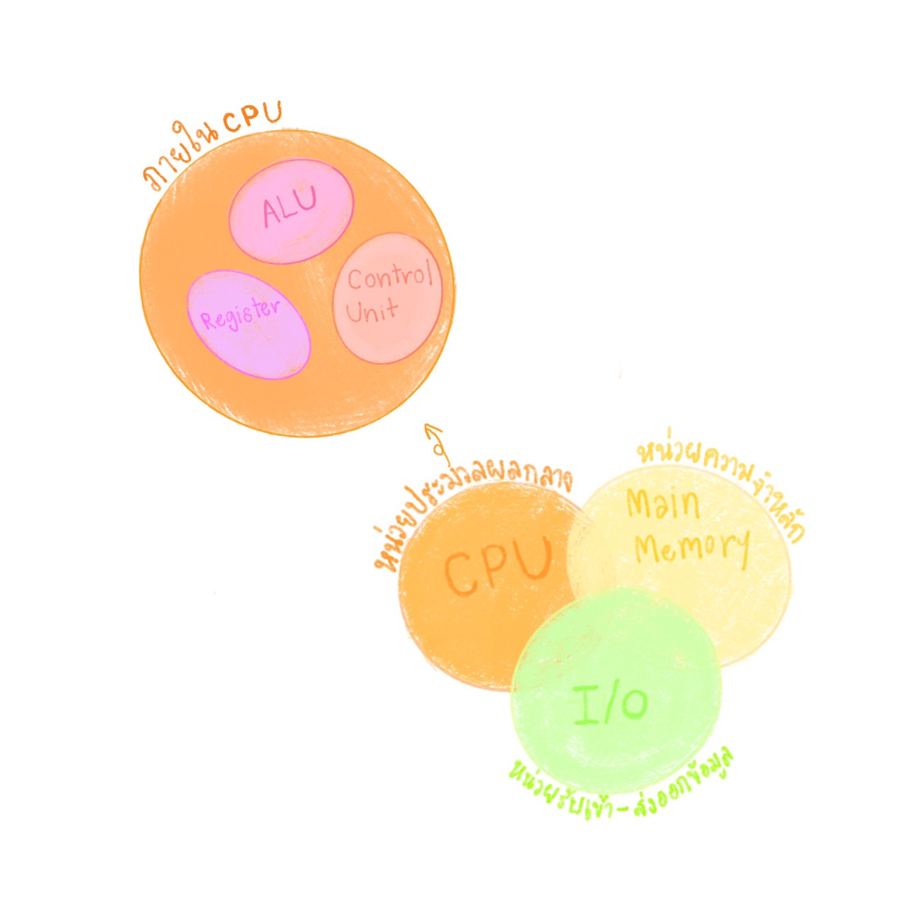

# รายงานวิชา CN210
## Computer Architecture

### สรุปเนื้อหา

#### **โครงสร้างและส่วนประกอบสำคัญทางคอมพิวเตอร์**
ประกอบด้วย 3 ส่วนใหญ่ๆ คือ

  1. *CPU* หรือ Central Processing Unit คือ หน่วยประมวลผลกลาง ซึ่งใน CPU ก็ประกอบด้วย 3 ส่วนเช่นกัน
  - *ALU* (Arithmetic Logic Unit) คำนวณทางคณิตศาสตร์ และตรรกศาสตร์
  - *Register* หน่วยความจจำชั่วคราว ใช้สำหรับพักข้อมูเพื่อคำนวณภายใน
  - *Control Unit* หน่วยควบคุม
  2. *Main Memoey* คือ หน่วยคอวามจำหลัก
  3. *I/O* หรือ Input and Output คือ หน่วยรับเข้าและส่งออกข้อมูล

#### **MIPS**
- เป็นหน่วยประมวลผล 32-bit แบบ RISC (Reduced Instruction Set Computer)
- ทุกคำสั่งจะมีขนาด 32-bit
- เป็นสถาปัตยกรรม แบบ Von Neumann

##### **รูปแบบคำสั่งจะแบ่งออกเป็น 3 ประเภท**

**R-Fromat**
เป็นคำสั่งเกี่ยวกับการคำนวณทางคณิตศาสตร์ และตรรกศาสตร์
ประกอบด้วย 6 ส่วน

ตัวอย่างคำสั่ง

**I-Format**
เป็นคำสั่งโหลด-เก็บ และเกี่ยวกับMemory
ประกอบด้วย 4 ส่วน

ตัวอย่างคำสั่ง

**J-Format**
เป็นคำสั่งกระโด(Jump)ไปยังตำแหน่งที่ระบุ ทั้งแบบมีและไม่มีเงื่อนไข
ประกอบด้วย 2 ส่วน

ตัวอย่างคำสั่ง

