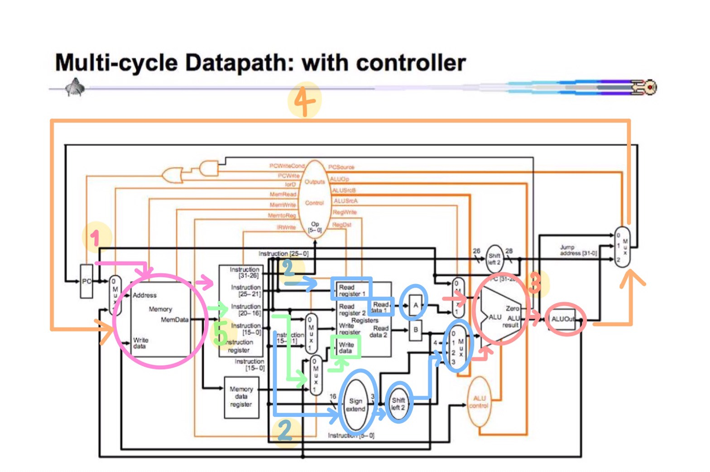
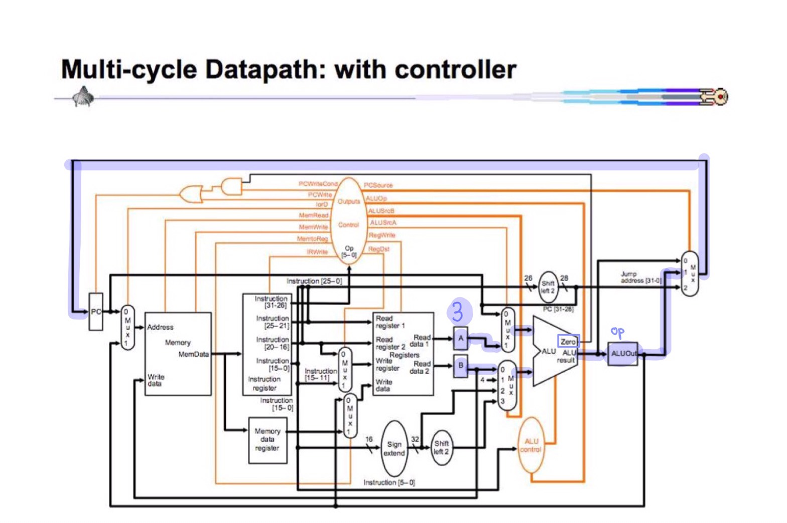

# รายงานวิชา CN210
## Computer Architecture

### สรุปเนื้อหา

#### **โครงสร้างและส่วนประกอบสำคัญทางคอมพิวเตอร์**
ประกอบด้วย 3 ส่วนใหญ่ๆ คือ

  1. *CPU* หรือ Central Processing Unit คือ หน่วยประมวลผลกลาง ซึ่งใน CPU ก็ประกอบด้วย 3 ส่วนเช่นกัน
  - *ALU* (Arithmetic Logic Unit) คำนวณทางคณิตศาสตร์ และตรรกศาสตร์
  - *Register* หน่วยความจจำชั่วคราว ใช้สำหรับพักข้อมูเพื่อคำนวณภายใน
  - *Control Unit* หน่วยควบคุม
  2. *Main Memoey* คือ หน่วยคอวามจำหลัก
  3. *I/O* หรือ Input and Output คือ หน่วยรับเข้าและส่งออกข้อมูล

#### **MIPS**
* เป็นหน่วยประมวลผล 32-bit แบบ RISC (Reduced Instruction Set Computer)  
*RISC*
   * มีชุดคำสั่งน้อยๆ และไม่ซับซ้อน
   * ทำงาน 1 คำสั่งต่อรอบสัญญาณนาฬิกา
   * กำหนดขนาดของ Instruction ให้มีขนาดที่แน่นอน
   * คำสั่งในการเข้าถึงหน่วยความจำหลัก จะใช้แค่ load word ( ดึงข้อมูล ) และ store word ( เก็บข้อมูล ) เท่านั้น
   * ใช้การอ้างตำแหน่งแบบตรงๆ ง่าย มี 2 แบบคือ แบบอ้างผ่าน Register ( Register Indirect ) และ Index
   * ใช้ Operation ที่เรียบง่าย ธรรมดาๆ และ มีไม่กี่ Operation เพื่อจะได้ใช้รอบการทำงานน้อยๆ
- ทุกคำสั่งจะมีขนาด 32-bit
- เป็นสถาปัตยกรรม แบบ Von Neumann คือ มีหน่วยความจำเดียว คำสั่งและข้อมูลจึงถูกเก็บไว้ในหน่วยความจำเดียวกัน  

      

#### **รูปแบบคำสั่งจะแบ่งออกเป็น 3 ประเภท**

**R-Fromat**
เป็นคำสั่งเกี่ยวกับการคำนวณทางคณิตศาสตร์ และตรรกศาสตร์
ประกอบด้วย 6 ส่วน

**I-Format**
เป็นคำสั่งโหลด-เก็บ และเกี่ยวกับMemory
ประกอบด้วย 4 ส่วน

**J-Format**
เป็นคำสั่งกระโด(Jump)ไปยังตำแหน่งที่ระบุ ทั้งแบบมีและไม่มีเงื่อนไข
ประกอบด้วย 2 ส่วน

# **การบ้านครั้งที่ 1**
 [ADD (R-Format)](https://youtu.be/VpKpuYbI4Tc)  

**คำสั่ง ADD**
เป็นคำสั่งประเภท R-Format ที่ประกอบไปด้วย6ส่วนดังที่เคยอธิบายไว้ข้างต้นแล้ว  
ตัวอย่างการใช้คำสั่ง *ADD $5,$1,$2*  
สามารถอธิบายได้ว่า  

โดยเราสามารถเปลี่ยนคำสั่งจากเลขฐาน2 เป็นฐาน16 ได้ดังนี้  

# **การบ้านครั้งที่ 2**
 [Machine Language](https://www.youtube.com/watch?v=oS9Mw7DQ22E)  

ตัวอย่าง *คำสั่งที่มนษย์เข้าใจ*  

ตัวอย่าง *คำสั่งที่คอมพิวเตอร์เข้าใจ*  

อธิบายคำสั่งในภาญาคอมพิวเตอร์  
  
**00000000:	08400000	//j 01000000**  
  
จะเริ่มตั้งแต่เปิดเครื่อง เราสมมติว่าเมื่อเป็นเครื่องมาแล้ว คอมพิวเตอร์จะเริ่มรันคำสั่งแรกที่ตหแหน่ง *00000000*  
จะเจอกับคำสั่งในรูปของเลขฐาน16 คือ *08400000* ซึ่งหาจะให้เข้าใจง่าย แปลงเป็นเลขฐาน2 ได้ดังนี้ 00001000010000000000000000000000  
คอมเตอร์มอง6-bitแรกที่เป็น op คือ 000010 เป็น J-Format คำสั่ง jump ไปที่ตำแหน่ง 01000000 แล้วมองต่อไปอีก 26-bit ที่เหลือทำการเติม 0 (4 ตัวหน้า) และ 0 (2 ตัวท้าย) จะได้ 32-bit ได้เป็น 00000001000000000000000000000000    

**00000004:	1A000000	//data  ==> $9**  
  
ที่ตำแหน่งถัดไป *00000004* คือการที่นำตำแหน่ง *00000000* ไปบวกเพิ่ม 4 เนื่องจาก ในแต่ละคำสั่งมี 4 bytes  
00000001000000000000000000000000 ในเลขฐาน16 คือ 1A000000 และสมมติให้ในตำแหน่งนี้ ได้เก็บค่า 10 เอาไว้ (*1A000000:	0000000A	// a = 10*)  
  
**01000000:	8C090004	// lw $9, $0(4)  
		8C090004 => 1000 1100 0000 1001 0000 0000 0000 0100**  

lw $9, $0(4) เป็นคำสั่งให้นำค่าที่ถูกเก็บไว้ในตำแหน่งที่$0 *00000000* บวกเพิ่ม4 (เลขในวงเล็บคือการบวกเพิ่ม) เป็นตำแหน่ง *00000004* (คือ 1A000000) ไปเก็บไว้ในตำแหน่งที่$9  
ซึ่งคำสั่งนี้ในเลขฐาน16 คือ 8C090004 และ ในเลขฐาน2 คือ 10001100000010010000000000000100  

**01000004:	8D210000	// lw $1, $9(0)  
		8D210000 => 1000 1101 0010 0001 0000 0000 0000 0000**    
  
lw $1, $9(0) เป็นคำสั่งให้นำค่าที่ถูกเก็บไว้ในตำแหน่ง$9 บวกเพิ่ม0 ก็ยังเป็นตำแหน่งที่$9 (คือ 1A000000) ไปเก็บไว้ในตำแหน่งที่$1  
ในตอนนี้ ตำแหน่ง$1 เก็บค่าตำแหน่ง 1A000000 ที่เก็บค่า 10 เอาไว้  
ซึ่งคำสั่งนี้ในเลขฐาน16 คือ 8D210000 และ ในเลขฐาน2 คือ 10001101001000010000000000000000  

**01000008:	8D220004	// lw $2, $9(4)  
		8D220004 => 1000 1101 0010 0010 0000 0000 0000 0100**  
  
lw $1, $9(0) เป็นคำสั่งให้นำค่าที่ถูกเก็บไว้ในตำแหน่ง$9 บวกเพิ่ม4 คือ 1A000004 ในที่นี้สมมติให้ ตำแหน่งที่1A000004 เก็บค่า 20 เอาไว้ (*1A000004:	00000014	// b = 20*) ไปเก็บไว้ในตำแหน่งที่$2  
ซึ่งคำสั่งนี้ในเลขฐาน16 คือ 8D220004 และ ในเลขฐาน2 คือ 10001101001000100000000000000100  
  
**0100000C:	00221820	//add $3, $1, $2  
		00221820 => 0000 0000 0010 0010 0001 1000 0010 0000**  
  
add $3, $1, $2 เริ่มแรกดูที่ op 6-bit แรก 000000 เป็นคำสั่งประเภท R-type จากนั้นดูที่func 6-bitสุดท้าย 100000 จึงรู้ว่าเป็นคำสั่งADD หรือคำสั่งให้ทำการบวก ค่าที่อยู่ในตำแหน่ง$1 (คือตำแหน่ง 1A000000 ที่เก็บค่า 10 เอาไว้) กับค่าที่อยู่ในตำแหน่ง$2 (คือตำแหน่ง 1A000004 ที่เก็บค่า 20 เอาไว้) และไปเก็บไว้ในตำแหน่งที่$3 ก็คือตำแหน่งที่ถัดไปจาก$2 address คือ ตำแหน่ง$2 บวกเพิ่มอีก4 คือ 1A000008  
ซึ่งคำสั่งนี้ในเลขฐาน16 คือ 00221820 และ ในเลขฐาน2 คือ 00000000001000100001100000100000   
  
**01000010:	AD230008	// sw $3, $9(8)  
		AD230008 => 1010 1101  0010 0011 0000 0000 0000 1000**  
  
sw $3, $9(8) เป็นการเขียนค่าที่ตำแหน่งที่$9 บวกเพิ่มอีก8 ลงใน$3 รู้ว่าเป็นคำสั่งsw คือดูที่ op 6-bit แรก 101011    
ซึ่งคำสั่งนี้ในเลขฐาน16 คือ AD230008 และ ในเลขฐาน2 คือ 10101101001000110000000000001000   

# **การบ้านครั้งที่ 3**
 [Multi-Cycle and Single-Cycle](https://www.youtube.com/watch?v=fYZY9J_bkPo)  

**ความแตกต่างระหว่าง Multi Cycle และ Single Cycle**  
  
* *1) ALU มีหน้าที่ทำการคำนวณทางคณิตศาสตร์ และตรรกศาสตร์*
   * Single Cycle มี ALU 3 ตัว
   * Multi Cycle มี ALU 1 ตัว
* *2) Memory หน่วยเก็บข้อมูลที่ได้รับมา*
   * Single Cycle มี Memory 2 ตัว แบ่งเป็น *Instruction Memory* ทำหน้าที่เก็บชุดคำสั่ง และ *Data Memory* มีหน้าที่เก็บข้อมูล  
   * Multi Cycle มี Memory 1 ตัว ทำการเก็บทั้งชุดคำสั่งและข้อมูลเอาไว้ด้วยกัน  
* *3) A และ B*  
   * Single Cycle ไม่มี A และ B  
   * Multi Cycle มี A และ B ที่เอาไว้พักค่าก่อนที่Muxจะทำการเลือกเข้าไปคำนวณในALU  
* *4) ALUout*  
   * Single Cycle ไม่มี ALUout
   * Multi Cycle มี ALUout ที่ทำหน้าที่เอาไว้พักข้อมูล หลังจากที่ทำการคำนวณในALUเสร็จแล้ว ก่อนที่จะดำเดินขั้นตอนถัดไป  
* *5) จำนวน Mux*  
   * Single Cycle มี Mux 4 ตัว ไว้คอยเลือกข้อมูลในการดำเนินงาน  
   * Multi Cycle มี Mux 5 ตัว ไว้คอยเลือกข้อมูลในการดำเนินงาน  
* *6) Shift left 2*  
   * Single Cycle หลังจากที่ทำการ Shift left 2 ข้อมูลจะเข้า ALU เลยโดยไม่ผ่านMux  
   * Multi Cycle หลังจากที่ทำการ Shift left 2 ข้อมูลจะรอที่ Mux ก่อนเพื่อรอให้Muxเลือกเข้าไปคำนวณใน ALU  
* *7) IRWrite ,RegWrite และ Memory Data Register*
   * Single Cycle หลังจากที่ทำการแปลงคำสั่งที่Instruction Memoryแล้ว จะเข้าไปรอที่Mux หลังจากนั้นจะเข้าสู่ RegWrite เลย
   * Multi Cycle หลังจากที่ทำการแปลงคำสั่งที่Memoryแล้ว คำสั่งจะถูกเก็บเข้าไปได้2ทาง คือ IRWrite และ Memory Data Register ก่อนที่จะเข้าไปรอที่Mux และถูกเลือกเข้าสู่ RegWrite  

# **การบ้านครั้งที่ 4**
 [Iw in Multi Cycle](https://www.youtube.com/watch?v=MC0156UI0q8)  

**คำสั่ง lw(load word) ใน Multi Cycle**  
  
* T1(สีชมพู) เมื่อได้รับคำสั่งมาแล้ว จะถูกส่งไปที่ Memory เพื่อนทำหารแปลงคำสั่งเป็นภาษาเครื่อง แล้วถูกส่งต่อเข้าไปใน IRWrite และนำ PCไปบวก4  
* T2(สีฟ้า) มี 2 ส่วน  
   * rs จะถูกส่งไป Read Register 1 จากนั้นไป Read Data 1 และถูกพักไว้ที่ A เพื่อรอการคำนวณ  
   * offset ในตอนแรกมี 16-bit จะถูกเปลี่ยนให้เป็น 32-bit ที่ Sign Extend 
* T3(สีส้มอ่อน) Mux เลือกค่าจาก A เข้ามาบวกกับ offset และนำค่าไปไว้ที่ ALUout  
* T4(สีส้ม) ค่าที่ได้จาหALUout คือตำแหน่งในMemory จะวิ่งกลับไปที่ Pc และ Memory อีกครั้ง เพื่อชี้ที่ค่าค่านั้นและอ่านค่าออกมา
* T5(สีเขียว) ค่าที่อ่านออกมานำไปใส่ไว้ใน Write Data (rt)

# **การบ้านครั้งที่ 5**
 [beq in Multi Cycle](https://www.youtube.com/watch?v=86ufMAOcvO4)  

**คำสั่ง beq(Branch on Equal) ใน Multi Cycle**  
  
* T1 เมื่อได้รับคำสั่งมาแล้ว จะถูกส่งไปที่ Memory เพื่อนทำหารแปลงคำสั่งเป็นภาษาเครื่อง แล้วถูกส่งต่อเข้าไปใน IRWrite และนำ PCไปบวก4  
  
* T2 มี 2 ส่วน  
   * rs และ rt จะถูกส่งไป Read Register จากนั้นไป Read Data และถูกพักไว้ที่ A และ B เพื่อรอการคำนวณ  
   * offset ในตอนแรกมี 16-bit จะถูกเปลี่ยนให้เป็น 32-bit ที่ Sign Extend และ ทำการ Shift left 2 จากนั้นนำไปเก็บไว้ที่ ALU และนำมาบวก4 กับ PC และเก็บที่ ALUout  
  
* T3 Mux เลือกค่าจาก A และ B เข้ามาคำนวณในALU เปรียบเทียบว่าAและBมีค่าเท่ากันหรือไม่  
   * AและBมีค่าเท่ากัน คอมพิวเตอร์จะดูค่าop ที่อยู่ใน ALUout ว่าเป็นคำสั่งอะไร และทำคำสั่งนั้น
   * AและBมีค่าไม่เท่ากัน คอมพิวเตอร์จะทำคำสั่งในตำแหน่งถัดไป
   
